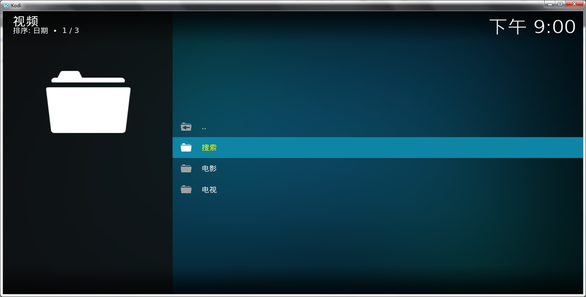
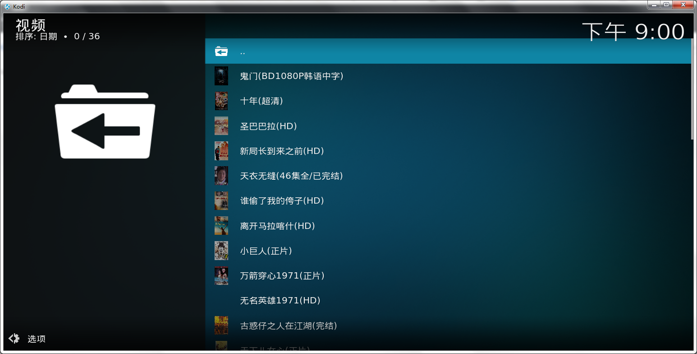

# plugin.video.hanju

海盗插件(Kodi)

韩剧视频插件（Kodi）基于爬虫技术，以Kodi为平台进行计算并抓取第三方资源网站数据采集自动拓扑生成的视频内容，软件依赖于IPTV插件播放功能.

声明：本插件开发之初的目的是用以学习Kodi插件开发及python技术整合，请勿用于其他用途。本视频插件是作者学习python在kodi计算平台的应用练习，该视频插件基于爬虫技术拓扑了来自于第三方网站公开的访问内容，插件所拓扑的播放资源均与作者无关，请下载学习后删除本插件！  
=========================   

